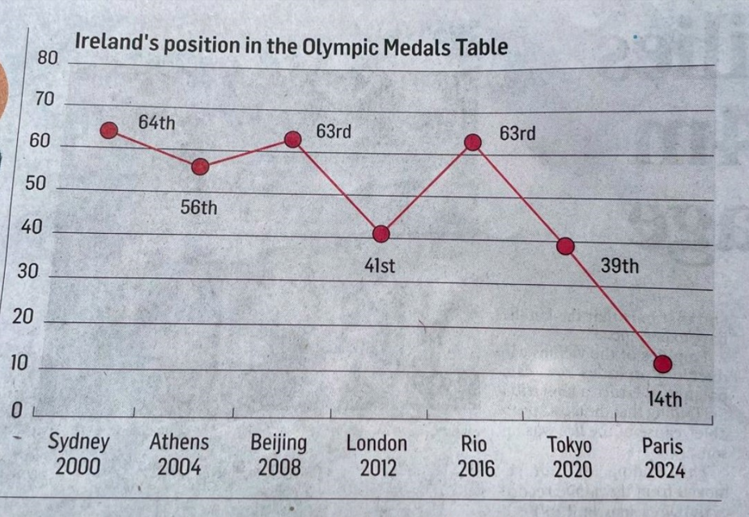



The other day, I saw this [Twitter](https://x.com/EemerEivers/status/1822239148519890981) post: “This is a masterclass (yet again) in @IrishTimes on how NOT to present information,” Dublin-based research consultant Dr Eemer Eivers wrote. “Quick glance & you’d be sure 🇮🇪 has tumbled DOWN the medal tables since 2000. FFS. This is criminal level breaking of the rules of how to share data.”

When we look at data, especially in charts, we expect it to be clear and intuitive. But sometimes, even well-meaning visuals can mislead us. Take a look at this chart showing Ireland’s position in the Olympic Medals Table from Sydney 2000 to Paris 2024.

<div class="figure" style="text-align: center">

<p class="caption"><span id="fig:unnamed-chunk-1"></span>Figure 1: Ireland's Olympic Story by Irish Times</p>
</div>


### A Misleading Chart: Ireland’s Olympic Success Story

At first glance, the upward and downward swings seem like Ireland's performance has been all over the place, but there's a catch. In rankings, lower numbers are better because they mean higher positions (closer to the top of the table). For instance, being 19th is much better than being 64th. However, the chart is plotted in a way that makes a higher position (closer to 1st place) appear worse. 


### What’s the Problem?

The y-axis of this chart is plotted in a way that makes a higher ranking (which should be good news) look bad, and a lower ranking (which should be a cause for concern) look like an improvement. This can confuse the viewer into thinking that Ireland's performance at the Paris 2024 Olympics was worse than it actually was.

### How to Fix It?

To make the chart more intuitive, the y-axis should either be inverted, so that the best positions are at the top, or we could explain that a downward trend in this context is actually a positive sign of improvement.




```
## ── Attaching core tidyverse packages ──────────────────────── tidyverse 2.0.0 ──
## ✔ dplyr     1.1.3     ✔ readr     2.1.4
## ✔ forcats   1.0.0     ✔ stringr   1.5.0
## ✔ ggplot2   3.5.0     ✔ tibble    3.2.1
## ✔ lubridate 1.9.3     ✔ tidyr     1.3.0
## ✔ purrr     1.0.2     
## ── Conflicts ────────────────────────────────────────── tidyverse_conflicts() ──
## ✖ dplyr::filter() masks stats::filter()
## ✖ dplyr::lag()    masks stats::lag()
## ℹ Use the conflicted package (<http://conflicted.r-lib.org/>) to force all conflicts to become errors
## Rows: 1344 Columns: 8
## ── Column specification ────────────────────────────────────────────────────────
## Delimiter: ","
## chr (4): Host_country, Host_city, Country_Name, Country_Code
## dbl (4): Year, Gold, Silver, Bronze
## 
## ℹ Use `spec()` to retrieve the full column specification for this data.
## ℹ Specify the column types or set `show_col_types = FALSE` to quiet this message.
```

```
## Warning: Using `size` aesthetic for lines was deprecated in ggplot2 3.4.0.
## ℹ Please use `linewidth` instead.
## This warning is displayed once every 8 hours.
## Call `lifecycle::last_lifecycle_warnings()` to see where this warning was
## generated.
```

```
## Warning: Removed 1 row containing missing values or values outside the scale range
## (`geom_point()`).
## Removed 1 row containing missing values or values outside the scale range
## (`geom_point()`).
```

```
## Warning: Removed 1 row containing missing values or values outside the scale range
## (`geom_text()`).
```





```r
library(tidyverse)

olympic <- read_csv("summer_olympic_medals.csv") %>% 
  janitor::clean_names() 
```

```
## Rows: 1344 Columns: 8
## ── Column specification ────────────────────────────────────────────────────────
## Delimiter: ","
## chr (4): Host_country, Host_city, Country_Name, Country_Code
## dbl (4): Year, Gold, Silver, Bronze
## 
## ℹ Use `spec()` to retrieve the full column specification for this data.
## ℹ Specify the column types or set `show_col_types = FALSE` to quiet this message.
```

```r
olympic <- olympic %>% 
  group_by(year, country_name) %>% 
  rowwise() %>% 
  mutate(medals = sum(c_across(gold:bronze)))

ireland <- olympic %>% 
  group_by(year) %>% 
  arrange(desc(gold), desc(silver), desc(bronze)) %>%
  mutate(medal_rank = min_rank(-gold * 1e6 - silver * 1e3 - bronze)) %>%
  filter(country_name == "Ireland" & year >= 2000) %>% 
  unite("host", host_city, year, sep = " ", remove = FALSE) 

ire_2024 <- tibble(host = c("Athens 2004", "Paris 2024"),
                   year = c(2004, 2024),
                   host_country = c("Greece", "France"),
                   host_city = c("Athens", "Paris"),
                   country_name = c("Ireland","Ireland"),
                   country_code = c("IRL", "IRL"),
                   gold = c(0, 4),
                   silver = c(0, 0),
                   bronze = c(0, 3),
                   medals = c(0, 7),
                   medal_rank = c(NA, 19))

ireland <- bind_rows(ireland, ire_2024)

# Custom function to add ordinal suffix
add_suffix <- function(x) {
  if (is.na(x)) {
    return(NA)
  } else if (x %% 100 >= 11 && x %% 100 <= 13) {
    return(paste0(x, "th"))
  } else if (x %% 10 == 1) {
    return(paste0(x, "st"))
  } else if (x %% 10 == 2) {
    return(paste0(x, "nd"))
  } else if (x %% 10 == 3) {
    return(paste0(x, "rd"))
  } else {
    return(paste0(x, "th"))
  }
}
# Apply the function to label the points
ireland %>%
  ggplot(aes(year, medal_rank)) +
  geom_point(size = 5.5, colour = "brown") +
  geom_line(data = ireland %>%
              filter(year > 2004), aes(year, medal_rank), size = 1, colour = "brown") +
  geom_point(size = 3, colour = "white") +
  geom_point(data = ireland %>%
               filter(year == 2004), aes(2004, 60), size = 20, colour = "grey95") +
  geom_text(data = ireland %>%
               filter(year == 2004), aes(2004, 60, label = "No\nMedal"), nudge_y = 1.2) +
  geom_text(aes(label = sapply(medal_rank, add_suffix)), nudge_y = 4) +
  scale_y_reverse(limits = c(70, 1), breaks = c(70, 60, 50, 40, 30, 20, 10, 1)) +
  scale_x_continuous(breaks = c(2000, 2004, 2008, 2012, 2016, 2020, 2024), labels = c("Sydney\n2000", "Athens\n2004", "Beijing\n2008", "London\n2012", "Rio de Janeiro\n2016", "Tokyo\n2020", "Paris\n2024")) +
  theme_light() +
  labs(x = "Year",
       y = "Medal Rank",
       title = "Ireland's Olympic Success Story",
       caption = "Source: Kaggle\n Viz: Ifeoma Egbogah") +
  theme(plot.caption = element_text(colour = "grey65", face = "italic"))
```

```
## Warning: Removed 1 row containing missing values or values outside the scale range
## (`geom_point()`).
## Removed 1 row containing missing values or values outside the scale range
## (`geom_point()`).
```

```
## Warning: Removed 1 row containing missing values or values outside the scale range
## (`geom_text()`).
```



### More problems

Regrettably, I discovered three additional issues while reviewing the data:

1. In 2004, Ireland didn't win any medals and thus wasn't included in the medals table. Although Irish show jumper Cian O'Connor initially won a gold medal in Athens, his horse later failed a doping test.
2. In 2008, Ireland was actually ranked 64th, not 63rd as stated on Wikipedia.
3. In 2024, Ireland finished in 19th place, not 14th according to the medal  count on the Olympics web page

In other words, Ireland's journey from 64th in Sydney 2000 to 19th in Paris 2024 is a success story, showing how the country has climbed the ranks over the years. 

When visualizing data, clarity is key, and sometimes, a small adjustment can make a big difference in how the story is told.


[Data](https://www.kaggle.com/datasets/ramontanoeiro/summer-olympic-medals-1986-2020) source.
